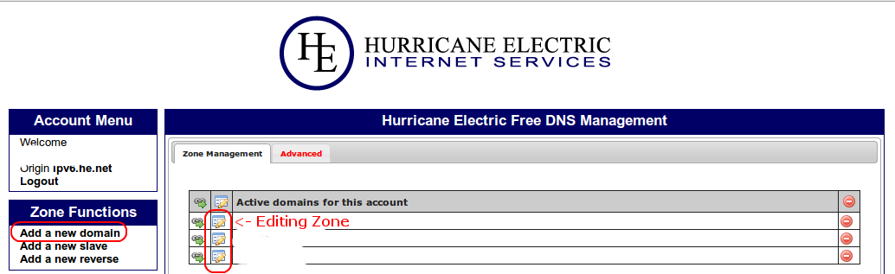
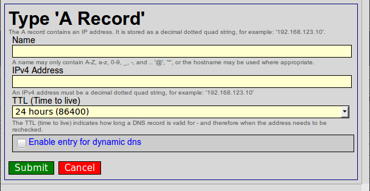
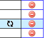
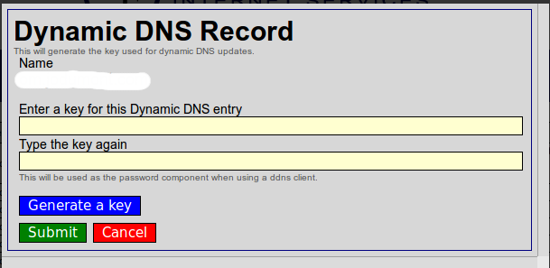

#REQUIREMENTS

  $ apt-get install -y dnstools curl

#DynDNS with HE.NET  
##How to Make your own DynDNS for Free with HE.NET and CURL
*If you want a Windows version <a href="https://github.com/bennettp123/dns.he.net-updater">PowerShell updater for dns.he.net </a>*

###1' Create an acount on <a href="https://dns.he.net">dns.he.net</a>  

###2' At your Registrer, change your Nameservers for :  
  - ns1.het.net
  - ns2.het.net
  - ns3.het.net
  - ns4.het.net
  - ns5.het.net

###3' Under Zone Functions, add a new domain  

###4' Edit your Zone and Add a A Record
*Dont forget to Enable this entry for dynamic dns*  

###5' Generate a password for this DNS Record
by clicking on 
  

then  
  

-----

##6' Copy the script On the Client site (Home Machine)

  $ curl -O https://raw.githubusercontent.com/jodumont/DynDNS-with-HE.NET/master/update_dns-he-net.sh  
  $ chmod 700 update_dns-he-net.sh  

###7' Adjust the $VARIABLE  
  $ nano update_dns-he-net.sh

###8' CRON it

  $ crontab -e
  */5 * * * * /_CHOOSE_YOUR_OWN_PATH_/update_dns-he-net.sh >/dev/null 2>&1

  
